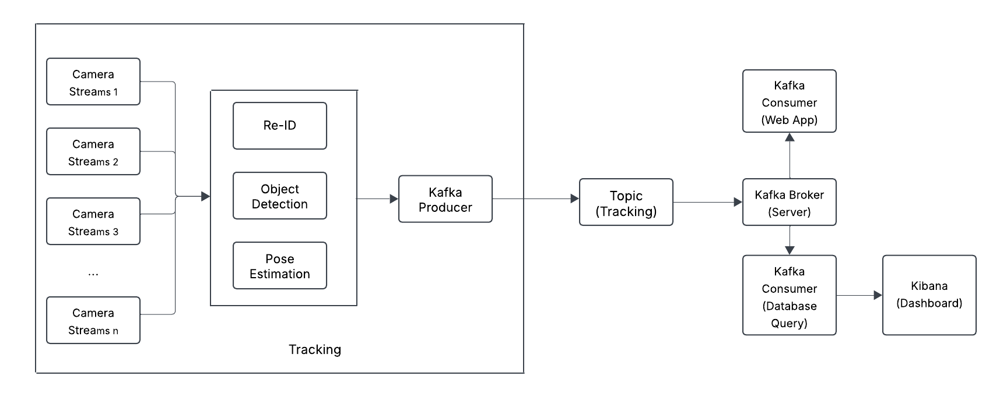

# Real-Time Multi-Camera Object Tracking System
This repository contain backend, frontend, consumers module for the project.
## Overall Pipeline



## Environment Setup
```bash
pip install -r requirements.txt
```

For frontend:
```bash
cd frontend
npm install
```

For Kafka:
```bash
cd kafka_run
bash scripts/setup.sh
```

In server.properties file, replace with host IP address:
```bash
advertised.listeners=PLAINTEXT://<HOST_IP>:9092,INTERNAL://localhost:9094
```
Then run:
```bash
cp server.properties.bk ~/kafka/config/server.properties
```

To create topic with name "tracking" run:
```bash
bash scripts/create_topic.sh
```

Start Kafka:
```bash
bash scripts/start_kafka.sh
```

## Run backend:
```bash
cd backend
uvicorn app:app --reload 
```

## Run frontend:
```bash
npm run dev
```

## Run consumer:
```bash
cd consumer
python consumer.py --topic tracking --not_use_elastic # If not use Elastic
python consumer.py --topic tracking --elastic_host <ELASTIC_HOST> --elastic_api_key <API_KEY> # If use Elastic, must provide HOST and API KEY.
```

## Acknowledgement

Big thanks to the following repo and challenge for sharing such helpful code and datasets:

https://github.com/ZhenyuX1E/PoseTrack

https://www.aicitychallenge.org/2024-ai-city-challenge/